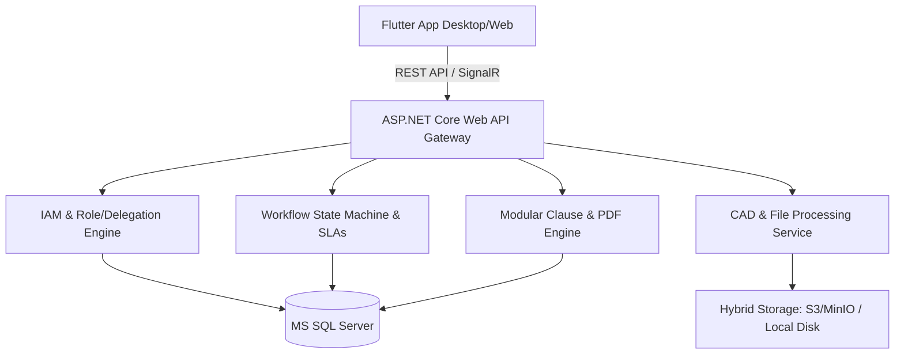
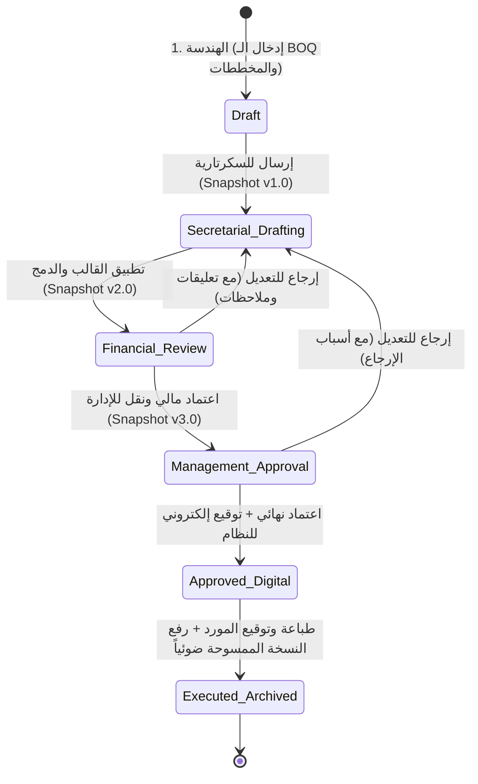

بناءً على إجاباتك الدقيقة والواضحة، قمنا بصياغة **وثيقة التصميم المعماري والهندسي الشاملة (System Architecture & Technical Design)** لمنصة **SASHECO CLM**، متوافقة مع التقنيات المحددة (**Flutter + .NET Core + SQL Server + Hybrid Storage**).

---

# 🏗️ التصميم المعماري الشامل لمنصة SASHECO CLM



---

## 1. البنية التحتية والتقنيات (Technology Stack Architecture)

| الطبقة (Layer) | التقنية المختارة | الدور الفني والمميزات |
| :--- | :--- | :--- |
| **Frontend** | **Flutter (Web & Desktop)** | واجهات متجاوبة، دعم كامل للغة العربية (RTL)، أداء عالي في الجداول واللوحات التفاعلية (Kanban & Charts). |
| **Backend API** | **.NET Core 8 / 9 (C#)** | **Clean Architecture** (CQRS مع MediatR)، أمان عالي، معالجة سريعة للملفات والبيانات. |
| **Database** | **MS SQL Server** | تخزين البيانات المهيكلة، دعم المعاملات البنكية (ACID)، تخزين الـ JSON Snapshots للنسخ المؤرشفة. |
| **PDF Engine** | **PuppeteerSharp / QuestPDF** | توليد ملفات PDF عربية احترافية بالترويسة الرسمية لـ SASHECO، دعم الترقيم (صفحة X من Y)، والأختام. |
| **CAD Processing** | **Server-side DWG Vectorizer / WebGL** | تحويل ملفات DWG إلى SVG/PDF أو عرضها عبر WebGL CAD Viewer مع إمكانية التنزيل والطباعة. |
| **Storage** | **Storage Abstraction (MinIO / S3 / Local)** | واجهة برمجية موحدة (`IFileStorageService`) للتبديل بين التخزين السحابي والمحلي بسلاسة. |
| **Real-time** | **SignalR** | إشعارات فورية In-App، وتحديث بطاقات الـ Kanban عند نقل الحالات دون الحاجة لإعادة تحميل الصفحة. |

---

## 2. مخطط دورة حياة العقد والمراجعة (Workflow State Machine)



### ميزات دورة العمل المدمجة:
1. **التعليقات المضمنة (Inline Redlining):** إمكانية تحديد بند قانوني محدد أو بند في الـ BOQ وإضافة ملاحظة تدقيق موجهة لقسم السكرتارية.
2. **النسخ المتزامنة (Snapshots):** يتم حفظ نسخة `JSON + Generated PDF` كاملة عند كل حركة في جدول `ContractSnapshots`.
3. **محرك الإنابة والتفويض (Delegation Engine):** جدول وسيط يفحص صلاحية المستخدم الفعلي أو من ينوب عنه خلال الفترة الزمنية المحددة.
4. **مراقبة فترات الإنجاز (SLA Monitor):** Background Service في .NET Core ترسل تنبيهات في حال تجاوز العقد مدة محددة في أي مرحلة.

---

## 3. تصميم قاعدة البيانات (MS SQL Server Database Schema)

### أ. جدول المستخدمين والصلاحيات والإنابة (IAM & Delegation)
* `Users` (Id, FullName, Email, PasswordHash, DepartmentId, SystemRoleId, IsActive)
* `Roles` (Id, RoleName: Admin, Engineer, Secretary, Financial, Management)
* `Permissions` (Id, PermissionKey: `Contract.Create`, `Contract.Approve.Financial`, `BOQ.Edit`, etc.)
* `UserPermissionOverrides` (UserId, PermissionId, IsGranted) *(جدول الاستثناءات المباشرة)*
* `UserDelegations` (Id, DelegatorUserId, DelegateeUserId, StartDate, EndDate, IsActive, Reason)

### ب. جدول البيانات الأساسية (Master Data)
* `Vendors` (Id, VendorCode, NameAr, NameEn, CRNumber, TaxNumber, ContactPerson, Phone, Email, CreatedAt)
* `Projects` (Id, ProjectCode, Name, Location, ProjectManagerId, Status, CreatedAt)
* `VendorAttachments` (Id, VendorId, FileType, FileUrl, ExpiryDate)

### ج. جدول محرك القوالب والبنود الديناميكية (Modular Clauses)
* `ClauseTemplates` (Id, Title, Category: [Legal, Admin, Financial, Technical], ContentWithPlaceholders, IsMandatory, DefaultOrder)
* `ContractTemplates` (Id, TemplateName, Description, IsActive)
* `TemplateClauses` (TemplateId, ClauseId, OrderIndex)

### د. جدول العقود والملاحق والـ BOQ (Contracts & Annexes)
* `Contracts` (Id, ContractNumber, Title, ProjectId, VendorId, Status, CurrentStage, TotalAmountBeforeVat, VatRate, VatAmount, TotalAmountWithVat, CreatedBy, CreatedAt)
* `ContractClauses` (Id, ContractId, Title, FinalContent, OrderIndex, IsModifiedFromTemplate)
* `ContractFinancialTerms` (ContractId, AdvancePaymentPct, AdvancePaymentAmount, RetentionPct, DelayPenaltyCapPct, PaymentTermsText)
* `ContractBOQItems` (Id, ContractId, ItemNumber, Description, Unit, Quantity, UnitRate, TotalBeforeVat, VatAmount, TotalWithVat)
* `ContractDrawings` (Id, ContractId, DrawingNumber, Title, RevisionNo, FileUrl, FileFormat: [DWG, PDF])
* `ContractAnnexes` (Id, AnnexNumber, ParentContractId, Type: [ScopeChange, CostIncrease, CostDecrease, TimeExtension], DeltaValue, NewEndDate, Status, Justification)
* `ContractComments` (Id, ContractId, ClauseId, BOQItemId, UserId, CommentText, IsResolved, CreatedAt)
* `ContractSnapshots` (Id, ContractId, StageName, VersionNumber, SnapshotDataJson, CreatedBy, CreatedAt)

---

## 4. محرك توليد العقود والمحرر (Modular Drafting & PDF Engine)

### استبدال المتغيرات التلقائي (Dynamic Variable Binding):
يدعم النظام استبدال المتغيرات المضمنة في البنود:
```text
"تم الاتفاق في يوم {Contract.Date} بين شركة ساشيكو للمقاولات (طرف أول) 
والسادة / {Vendor.Name}، سجل تجاري رقم {Vendor.CRNumber} ورقم ضريبي {Vendor.TaxNumber} 
على تنفيذ أعمال مشروع {Project.Name} بقيمة إجمالية قدرها {Contract.TotalWithVat} ريال سعودي..."
```

### مواصفات ملف الـ PDF الرسمي:
1. **الترويسة (Header):** شعار SASHECO الرسمي + كود المشروع + كود العقد والنسخة (Rev).
2. **التذييل (Footer):** ترقيم الصفحات `صفحة X من Y` + باركود/QR Code للتحقق الرقمي.
3. **حاوية التوقيعات (Signature Blocks):** مكان مخصص لتوقيع وختم الطرف الأول والطرف الثاني في أسفل كل صفحة، وجدول اعتماد موسع في الصفحة الختامية.

---

## 5. واجهات المستخدم في Flutter (Multi-View Engine)

```
lib/
├── core/                  # Network, Theme, Localization (Arabic RTL), Storage
├── features/
│   ├── auth/              # Login, Session & JWT Handling
│   ├── iam/               # User Management, RBAC Matrix, Delegation Screen
│   ├── vendors/           # Vendor List, Add/Edit, Attachments, Per-Project Metrics
│   ├── projects/          # Projects Master Data & Financial Summary
│   ├── contract_editor/   # Modular Clause Builder, Variable Binding, BOQ Grid
│   ├── cad_viewer/        # DWG/DXF In-App Web Viewer & Markup
│   ├── workflow/
│   │   ├── list_view/     # Advanced DataGrid (Export to Excel/PDF, Filters)
│   │   ├── kanban_view/   # Drag & Drop Workflow Cards with Role Restrictions
│   │   └── chart_view/    # Stacked Bars, Donut Charts & KPI Dashboard
│   └── signing_archive/   # Digital Signature Pad & Scanned Wet-Sign Upload
```

---

## 🎯 خطة التنفيذ المقترحة (Roadmap)

1. **المرحلة الأولى:** إعداد الـ Backend الأساسي (.NET Core + SQL Server ERD + IAM & RBAC + Authentication).
2. **المرحلة الثانية:** بناء شاشات البيانات الأساسية (Vendors, Projects) مع نمط العرض المتعدد (List, Kanban, Charts) في Flutter.
3. **المرحلة الثالثة:** محرك القوالب والبنود (Modular Clauses + BOQ Grid + Variable Binding + PDF Generator).
4. **المرحلة الرابعة:** محرك دورة العمل (4-Step Workflow + Redlining Comments + Delegation + Audit Snapshots).
5. **المرحلة الخامسة:** مستعرض الـ CAD وتكامل التوقيع والأرشفة الرقمية.

Created REQUIREMENTS.md

ممتاز جداً! تم تحليل شيت الإكسيل الخاص بشركة **SASHECO** بدقة متناهية، وتحديث وثيقة متطلبات النظام [**REQUIREMENTS.md**](file:///d:/sasheco-v1/REQUIREMENTS.md) لتكون مطابقة **طبق الأصل (100%)** مع هذا النموذج القياسي.

---

### 📊 خلاصة تحويل نموذج إكسيل SASHECO إلى بنية رقمية في النظام:

#### 1. الترويسة وبيانات الفترة (Header Metadata):
* **المسار / المشروع:** اسم المشروع أو المسار.
* **اسم المقاول / المورد:** (مثال: *الوطنية للأنظمة المتطورة*).
* **نوع الأعمال:** (مثال: *أعمال حريق*).
* **مستخلص رقم:** الترقيم التسلسلي للمستخلص (مثال: *مستخلص رقم 2*).
* **فترة المستخلص:** **من تاريخ** (`From Date`) إلى **حتى تاريخ** (`To Date`).

---

#### 2. أعمدة مصفوفة جدول المستخلص (DataGrid Matrix & Calculations):
تمت مطابقة الأعمدة والمعادلات الحسابية الآلية كما هي في الشيت:

| # | اسم العمود في الشيت | طريقة الحساب في النظام |
| :---: | :--- | :--- |
| **1** | **الكمية الحصر** | الكمية التعاقدية المعتمدة من العقد والملاحق. |
| **2** | **الكمية السابقة** | مستدعاة تلقائياً من المستخلص السابق رقم (N-1). |
| **3** | **الكمية الفعلية** | إدخال مهندس الموقع / الحصر. |
| **4** | **الفرق** | معادلة تلقائية: `الكمية الفعلية - الكمية السابقة`. |
| **5** | **الوحدة** | من جدول كميات العقد (عدد، م2، م3، مقطوعية...). |
| **6** | **سعر الوحدة** | فئة السعر المعتمدة بالعقد. |
| **7** | **إجمالي الكمية السابقة** | معادلة تلقائية: `الكمية السابقة × سعر الوحدة × نسبة الإنجاز السابقة`. |
| **8** | **نسبة الإنجاز السابقة** | النسبة المعتمدة في المستخلص السابق. |
| **9** | **نسبة الإنجاز الحالية** | إدخال / تدقيق مهندس الموقع. |
| **10** | **الإجمالي الحالي** | معادلة تلقائية: `الكمية الفعلية × سعر الوحدة × نسبة الإنجاز الحالية`. |
| **11** | **الإجمالي المستحق** | معادلة تلقائية: `الإجمالي الحالي - إجمالي الكمية السابقة`. |

---

#### 3. التجميعات والتسويات المالية السفلية (Footer Summary):
1. **صف الإجمالي العام:**
   * تجميع `إجمالي الكمية السابقة`.
   * تجميع `الإجمالي الحالي`.
   * تجميع `الإجمالي المستحق`.
2. **دفعات (Payments):** تسوية الدفعات السابقة أو المقدمة.
3. **نسبة خصم على العقد (Contract Discount % / Deductions):** تطبيق الخصومات أو محجوز الضمان التعاقدي.
4. **المستحق للصرف (Net Payable for Disbursement):** صافي المبلغ النهائي المعتمد للصرف للمقاول.

---

#### 4. مصفوفة التوقيعات والاعتمادات الرسمية (Four-Tier Approvals):
تم اعتماد الترتيب والمسميات الوظيفية الأربعة الظاهرة أسفل النموذج:
1. ✍️ **مدير المكتب الفني (Technical Office Manager)**
2. ✍️ **مدير الإدارة الهندسية (Engineering Department Manager)**
3. ✍️ **إدارة الحسابات (Accounting Department)**
4. ✍️ **المدير المالي (Financial Director)**

---